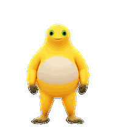
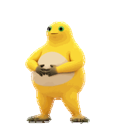

# 奶龙 · Nailong Codex Pet 🐥

让一只圆滚滚的奶龙陪你工作：发呆、奔跑、挥手、跳跃，还有捧腹大笑。

**非官方同人作品 · 透明精灵图 · 9 组动画 · 16 个视线方向**



[下载完整 v2 精灵图](assets/nailong-v2.png?raw=true) · [下载网页兼容 v1 精灵图](assets/nailong-v1.png?raw=true) · [大笑预览](previews/laugh.gif) · [逐帧总览](previews/contact-sheet.png)

## 安装

### 桌面应用：完整 v2

支持宠物安装深链的 ChatGPT / Codex 桌面版本可使用下面的地址。将整行复制到浏览器地址栏，允许打开应用，然后按应用内提示确认安装：

```text
codex://pets/install?name=%E5%A5%B6%E9%BE%99&imageUrl=https%3A%2F%2Fraw.githubusercontent.com%2Flizaixi01%2Fnailong-codex-pet%2Fmain%2Fassets%2Fnailong-v2.png&description=%E9%9D%9E%E5%AE%98%E6%96%B9%E5%A5%B6%E9%BE%99%E5%90%8C%E4%BA%BA%E5%AE%A0%E7%89%A9%EF%BC%8C%E5%8C%85%E5%90%AB%E6%8D%A7%E8%85%B9%E5%A4%A7%E7%AC%91%E5%8A%A8%E7%94%BB&spriteVersionNumber=2
```

GitHub 可能不会把 `codex://` 渲染成可点击链接，因此这里保留完整地址。安装需要支持该功能的桌面应用、可访问的公开图片地址，以及 `spriteVersionNumber=2`。本仓库没有完成所有桌面版本的端到端安装测试。

安装后在宠物设置中选择奶龙。浮动宠物可通过 `/pet` 显示或隐藏；具体入口和可用性以你的应用版本为准。

### 网页上传：兼容 v1

[官方 Pets 文档](https://learn.chatgpt.com/docs/pets) 当前说明网页上传接受 **1536 × 1872** 的透明 PNG / WebP。请下载 `assets/nailong-v1.png`，在支持自定义宠物的网页设置入口上传。

v1 是完整 v2 前 9 行的无缩放裁切，保留全部动画，但不包含额外的 16 个视线方向。不要把 v2 强行缩放到 v1 尺寸。

深链参数来源：[官方 Commands 文档](https://learn.chatgpt.com/docs/reference/commands#pets)。

## 动画与格式

- v2：1536 × 2288，RGBA PNG，8 列 × 11 行，每格 192 × 208
- v1：1536 × 1872，RGBA PNG，8 列 × 9 行
- 行号从 0 开始；每行有效帧从左向右排列，剩余格透明

| 行 | 状态槽位 | 有效帧 | 画面 |
| --- | --- | ---: | --- |
| 0 | idle | 6 | 待机 |
| 1 | running-right | 8 | 向右跑 |
| 2 | running-left | 8 | 向左跑 |
| 3 | waving | 4 | 挥手 |
| 4 | jumping | 5 | 跳跃 |
| 5 | failed | 8 | 失落 |
| 6 | waiting | 6 | 等待 |
| 7 | running | 6 | 思考 |
| 8 | review | 6 | 捧腹大笑 |
| 9–10 | look | 16 | 视线方向 |



大笑动画放在 `review` 槽位。应用的 **Ready** 状态是否实际触发这个槽位尚未完成运行时验证；这里不承诺某个任务事件必定播放大笑。预览 GIF 只展示素材动画，不代表应用实际调度顺序。

## 校验与开发

无需安装 Python 第三方依赖即可校验发布文件：

```sh
python3 tools/verify_assets.py
```

`manifest.json` 记录文件 SHA-256、尺寸和格式版本。校验工具检查文件完整性和 PNG 尺寸，不替代应用内安装、动画触发或兼容性测试。

## 许可

原创文档和校验代码采用 [MIT](LICENSE)。**角色相关图片和动画不包含在 MIT 授权中**；请阅读 [角色与素材权利说明](NOTICE.md)。本项目不代表角色权利人或 OpenAI，也不授予奶龙角色的商业使用权。

## English

An unofficial Nailong companion sprite pack with nine animation states, a belly-laugh animation in the review slot, and sixteen look directions in v2. Use the full v2 sheet with `spriteVersionNumber=2`, or the nine-row v1 export for the documented web uploader. Runtime Ready-to-review mapping has not been verified. Original docs and verification code are MIT licensed; character artwork and animations are excluded. See [NOTICE](NOTICE.md).
